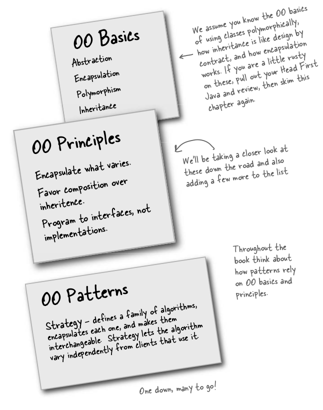

## Strategy Pattern

Consider a game making company which make DuckSimulated Games.
Now the company has simple ducks which can swim and they have their names.

But company want to compete in the market and thus adding some features to Ducks out there
Like Fly and Quack

As of now implementation is as follows which is: 
Duck class is super class
And we have mallard duck class, Redhead duck class, which extend

So the developer says that putting fly and quack in Duck class would do the thing but that is trick as, some duck like wooden duck don't make quack sound and cannot fly also
Some ducks like rubber can make sound wheras it cannot fly.

Moreover we can have different algos for flying and quacking much big.

So we come to know that we want different behaviour, so it interface looks good, but problem is that interface dont have implmentation and that would introduce repetition and it makes maintainance un-easy when algo changes are to be made, we have to make changes in more than one file.
We have different algos or different behaviours for each of them so we can encapsulate the things which are changing. And for this we have our first design pattern.

So here comes Strategy pattern:
The Strategy Pattern defines a family of algorithms,encapsulates each one, and makes them interchangeable. Strategy lets the algorithm vary independently from clients that use it.

### Learnings
Encapsulates what vary (Like flyable and quackable behaviour)
Favour Composition over inheritance (Like use Interface instance, rather than implementing interface, as we can use runtime polymorphism)
Program to interface not implementation (Use Interface instance rather than class instance, because if we do so then we can make changes in program easily rather than making changes in code directly.)

