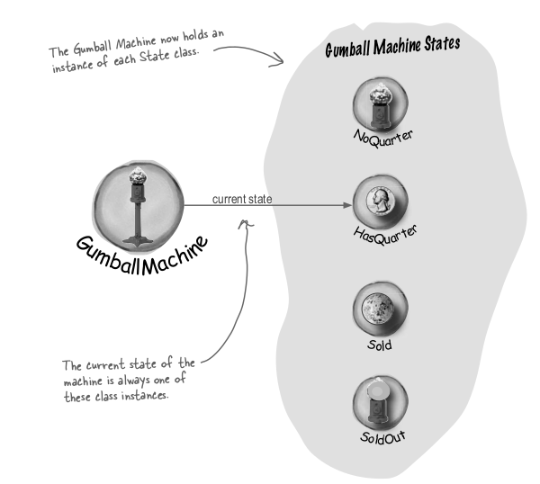
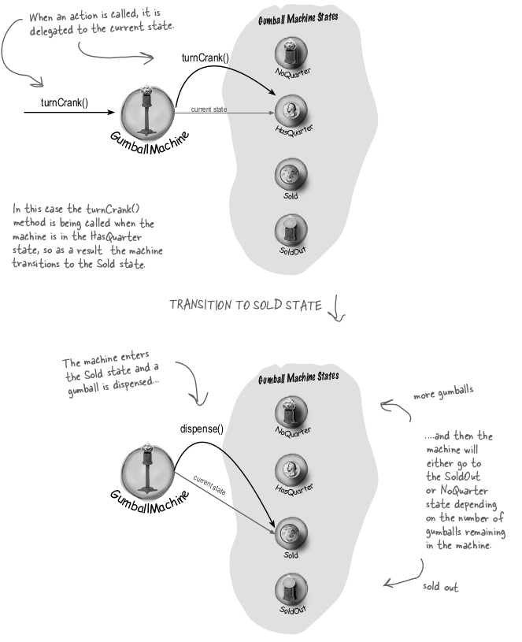
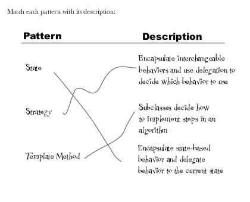
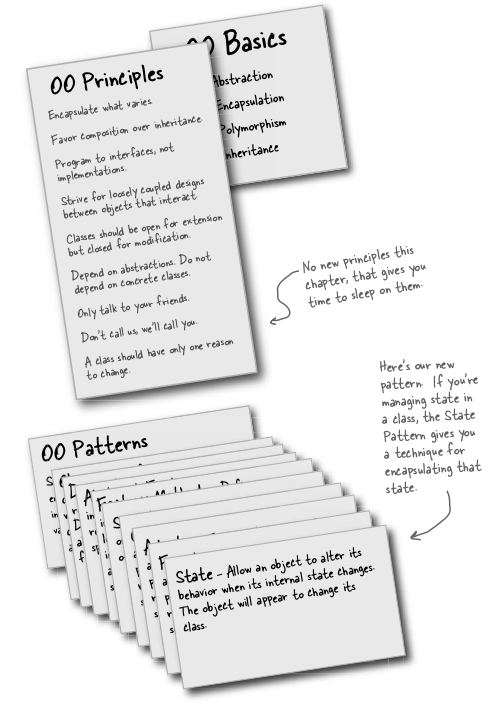

# State Pattern

This pattern is made for designing those system which show different state behaviour. 

The State Pattern allows an object to alter its behavior
when its internal state changes. The object will appear to
change its class.

When using this pattern it would be like

Difference 

Summary

