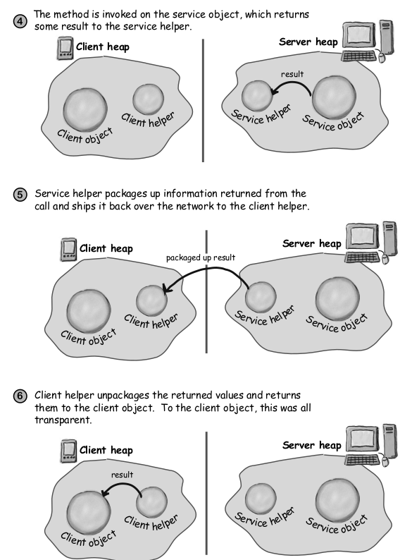

# Proxy Pattern

The Proxy Pattern provides a surrogate or
placeholder for another object to control access to it.

Use the Proxy
Pattern to create a
representative object
that controls access
to another object,
which may be remote,
expensive to create or
in need of securing.

# Virtual Proxy

# Match the patterns

Decorator - Wraps another object and provides additional behavior for it

Proxy - Wraps another object to control access to it

Adapter - Wraps another object and provides a different interface to it

Facade - Wraps a bunch of objects to simplify their interface

# Summary

