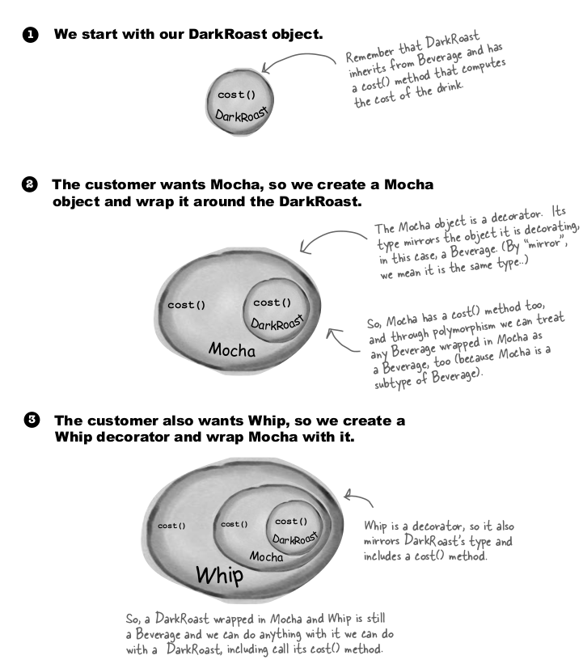
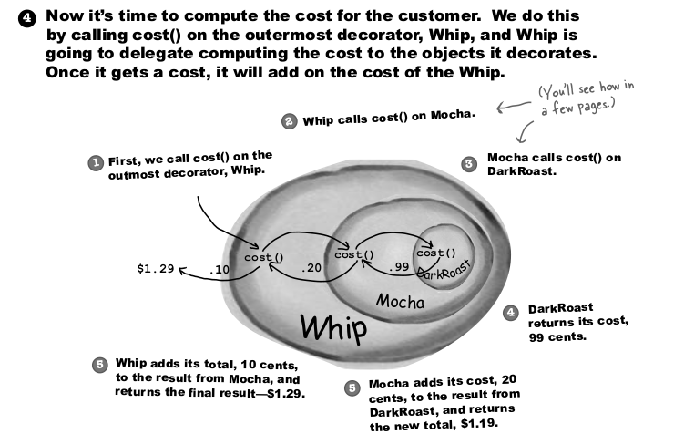
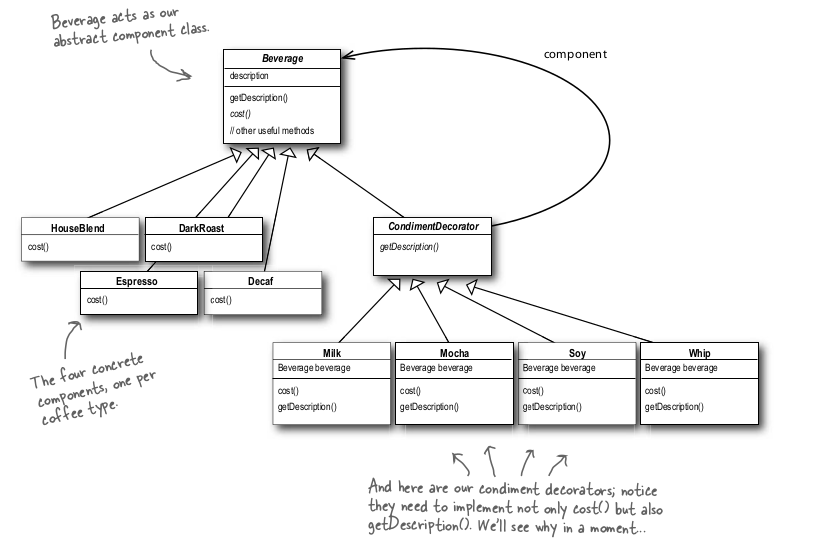
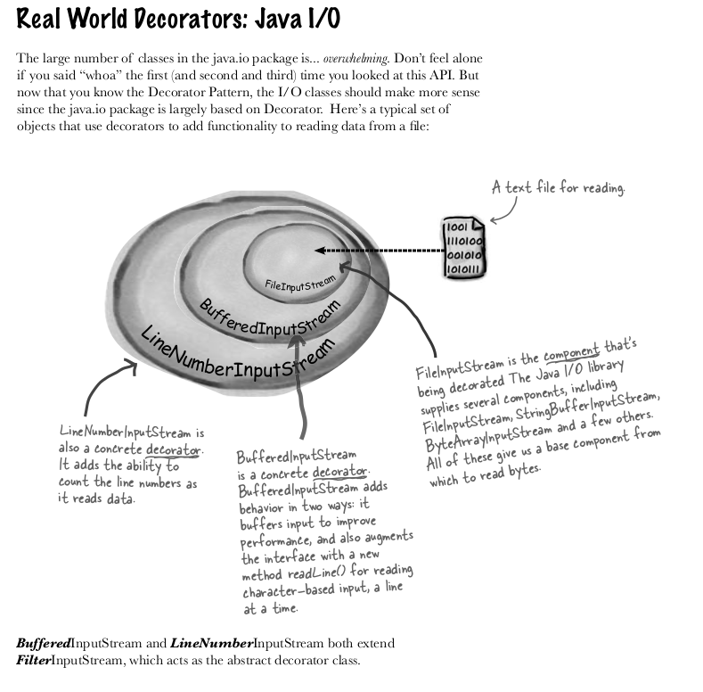
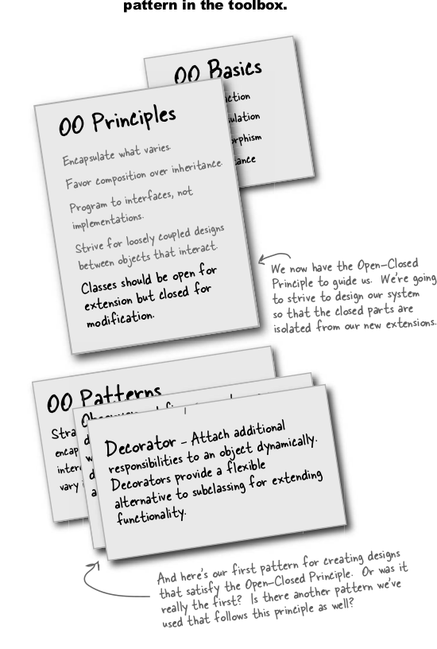

##Decorator Pattern (Open-Close Principle )

####Design Principle
Classes should be open for extension, but closed for modification.

Our goal is to allow classes to be easily extended to incorporate new behavior without modifying existing code.
#####What do we get if we accomplish this? 
Designs that are resilient to change and fl exible enough to take on new functionality to meet changing requirements.

#####Note
- While it may seem like a contradiction, there are techniques for allowing code to be extended without direct modification.
- Be careful when choosing the areas of code that need to be extended; applying the Open-Closed Principle EVERYWHERE is wasteful, unnecessary, and can lead to complex, hard to understand code.

####Some Questions
- Question - Open for extension and closed for modification? That sounds very contradictory. How can a design be both?
    
    That’s a very good question. It
    certainly sounds contradictory at first.
    After all, the less modifiable something
    is, the harder it is to extend, right?
    As it turns out, though, there are some
    clever OO techniques for allowing
    systems to be extended, even if we can’t
    change the underlying code. Think
    about the Observer Pattern (in Chapter
    2)... by adding new Observers, we can
    extend the Subject at any time, without
    adding code to the Subject. You’ll see
    quite a few more ways of extending
    behavior with other OO design
    techniques.
    
- Question - Okay, I understand Observable,but how do I generally design something to be extensible, yet closed for modification?
    
    Many of the patterns give us
    time tested designs that protect your
    code from being modified by supplying
    a means of extension. In this chapter
    you’ll see a good example of using the
    Decorator pattern to follow the Open-
    Closed principle.
  
- For more see page number 99 of book.

###Star-buck problem
Modelling it into better problem as per understanding.
Suppose we have paneer pizza and we can serve that pizza with topping which includes sauce, chill-powder, oregano. Now each topping has some cost associated with it and different people want 
different quantity. So what we can have is in simple way
Pizza class which would be sub-class by different classes like paneer-pizza with oregano, paneer-pizza with chilli and oregano,......

So situation would be like 1 parent class and 300 sub-class, which is class explosion

Problem is making dishes (Tea/Coffee) with different flavour/condiments on top of it.

So is there a better way
Another way is create getter and setter for powder,sauce and oregano's price in base class, and all sub-class would override the price, 
- but this will lead to another problem that when price changes (like ) then we have to change price in multiple subclass class.
- New condiments will force us to add new methods and alter the cost method in the superclass.
- We may have new beverages. For some of these beverages (iced tea?), the condiments may not be appropriate, yet the Tea subclass will still inherit methods like hasWhip().
- What if a customer wants a double mocha?

###So Decorator pattern in rescue

Okay, here’s what we know so far...
- Decorators have the same supertype as the objects they decorate.
- You can use one or more decorators to wrap an object.
- Given that the decorator has the same supertype as the object it decorates, we can pass around a decorated object in place of the original (wrapped) object.
- The decorator adds its own behavior either before and/or after delegating to the object it decorates to do the rest of the job.
- Objects can be decorated at any time, so we can decorate objects dynamically at runtime with as many decorators as we like.

Let’s first take a look at the Decorator Pattern description:
The Decorator Pattern attaches additional responsibilities to an object dynamically. Decorators provide a fl exible alternative to subclassing for extending functionality.

Problem is making dishes (Tea/Coffee) with different flavour/condiments on top of it.

Some of the JAVA API that use decorator

####Learnings

