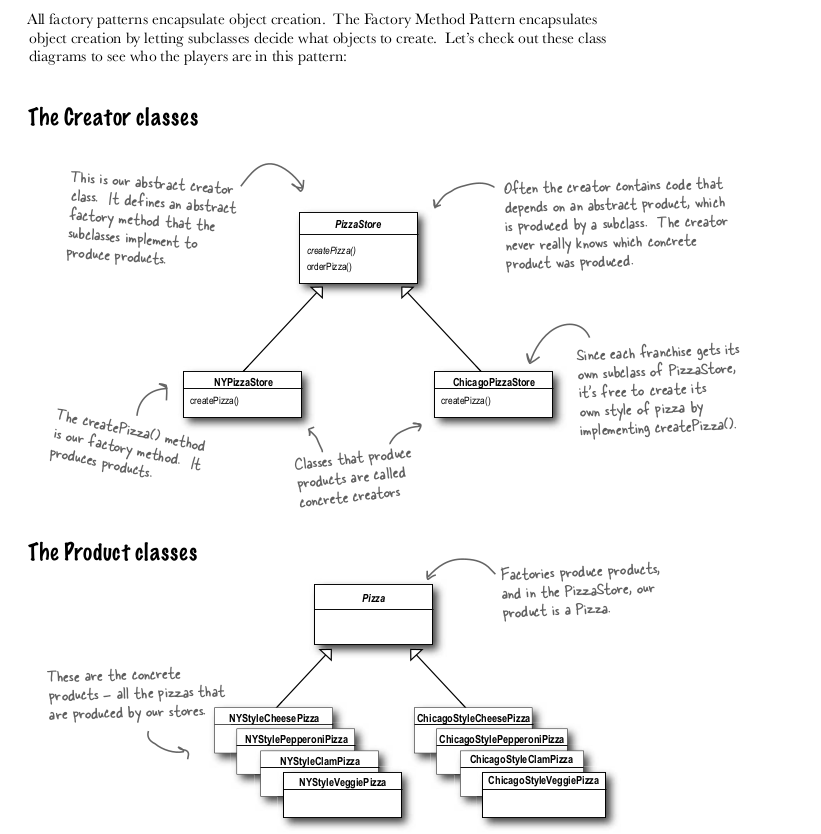
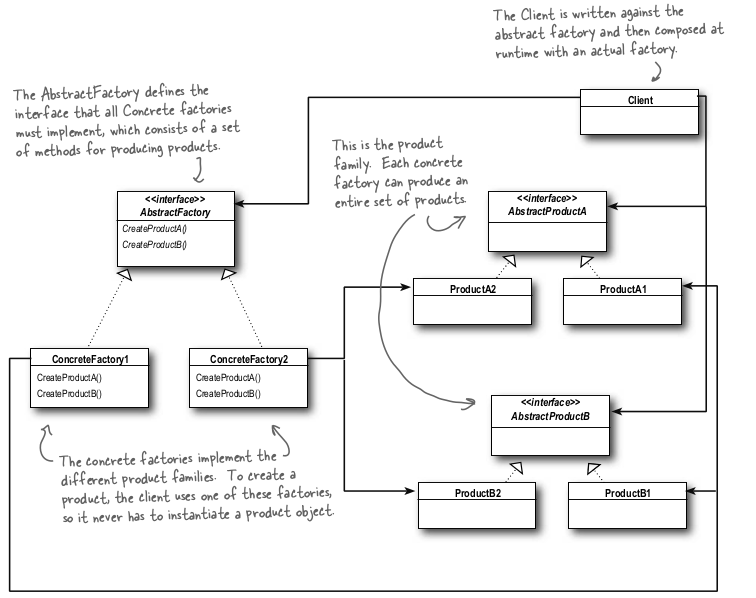
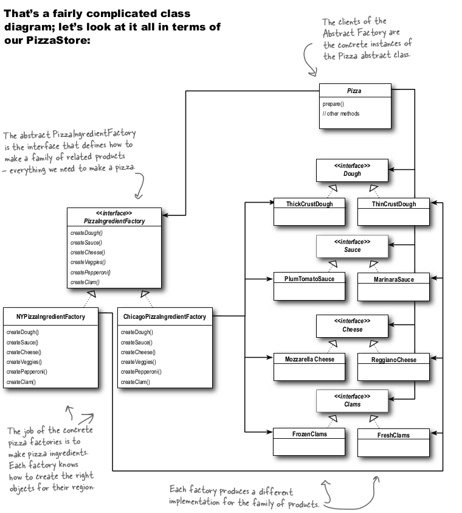
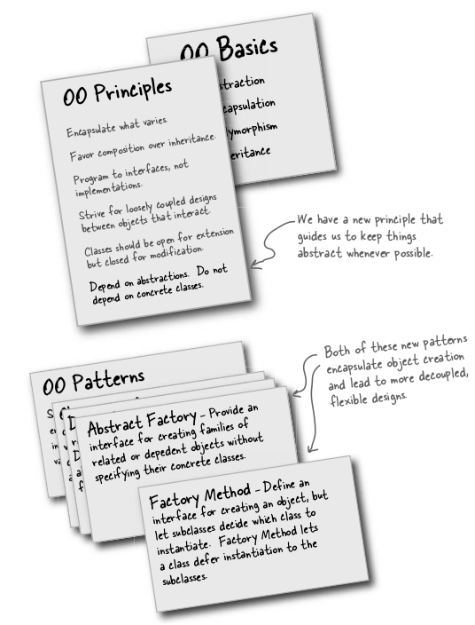

# Factory Pattern

Get ready to bake some loosely coupled OO designs. There is more to making objects than just using the new operator. You’ll learn that instantiation is an activity that 
shouldn’t always be done in public and can often lead to coupling problems. And you don’t want that, do you? Find out how Factory Patterns can help save you from embarrasing dependencies.


The Factory Method Pattern defines an interface for creating an object, but lets subclasses decide which class to instantiate. Factory Method lets a class defer instantiation to subclasses.


#### Problem
There is a pizza company which makes different types of Pizzas, so here is the code
````
    Pizza orderPizza(String type) {
        Pizza pizza;
        if (type.equals(“cheese”)) {
            pizza = new CheesePizza();
        } else if (type.equals(“greek”) {
            pizza = new GreekPizza();
        } else if (type.equals(“pepperoni”) {
            pizza = new PepperoniPizza();
        }
        pizza.prepare();
        pizza.bake();
        pizza.cut();
        pizza.box();
        return pizza;
    }
````
The above code is not closed for modification, if we want to stop producing greek pizza and add two more pizza than we need to add 6 lines and delet 3 lines in above code.

So to make orderPizza close for modification we put factory pattern
#### Note 
What is benefit of this? Are not we pushing the thing to another class?
<hr>
One thing to remember is that the SimplePizzaFactory may have many clients. We’ve only seen the orderPizza() method;
however, there may be a PizzaShopMenu class that uses the factory to get pizzas for their current description and price. We
might also have a HomeDelivery class that handles pizzas in a different way than our PizzaShop class but is also a client of the factory.
So, by encapsulating the pizza creating in one class, we now have only one place to make modifications when the
implementation changes.Don’t forget, we are also just about to remove the concrete instantiations from our client code!

Below is the sample implementation

`````
    Pizza orderPizza(String type) {
        Pizza pizza=factory.ceratePizza(type);
        pizza.prepare();
        pizza.bake();
        pizza.cut();
        pizza.box();
        return pizza;
    }
    public class SimplePizzaFactory {
        Pizza pizza = null;
        if (type.equals(“cheese”)) {
            pizza = new CheesePizza();
        } else if (type.equals(“pepperoni”)) {
            pizza = new PepperoniPizza();
        } else if (type.equals(“clam”)) {
            pizza = new ClamPizza();
        } else if (type.equals(“veggie”)) {
            pizza = new VeggiePizza();
        }  
        return pizza;
    }
`````

Now suppose we want to go one step ahead and we are expanding and we have franchise all around.


Summarising things till now


The Factory Method Pattern defi nes an interface for creating an object, but lets subclasses decide which
class to instantiate. Factory Method lets a class defer instantiation to subclasses.


<hr>

### Problem
We did everything well but some franchises used bad quality ingredients to minimize the cost, so we want to stop that, the one way to stop them is using our own factory that make quality products and ship them to these franchises.
So we create Ingredients factory for each franchise, so that they can get quality ingredients from there without affection our brand-value.

This would create factory for all ingredients 

#### Abstract Factory Pattern defined
The Abstract Factory Pattern provides an interface for creating families of related or dependent objects without specifying their concrete classes.


Lets see what was this in our case:



### Factory vs Abstract Factory

