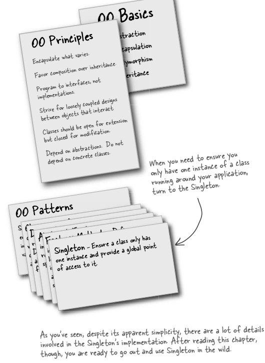

# Singleton Pattern

The Singleton Pattern ensures a class has only one instance, and provides a global point of access to it.

Lazy initialization in Java?
How its implemented? Eagerly Created instance vs Instance created Lazily?

<hr>

#### Can we improve multithreading?
Because Synchronized Keyword is expensive. 

- ##### Do nothing if the performance of getInstance() isn’t critical to your application
That’s right; if calling the getInstance() method isn’t causing substantial overhead for your
application, forget about it. Synchronizing getInstance() is straightforward and effective. Just keep
in mind that synchronizing a method can decrease performance by a factor of 100, so if a high
traffic part of your code begins using getInstance(), you may have to reconsider.

- ##### Eager Declaration, instance is guaranteed to be created only once
If your application always creates and uses an instance of the Singleton or the overhead of
creation and runtime aspects of the Singleton are not onerous, you may want to create your
Singleton eagerly, like this:
````
    public class Singleton {
        private static Singleton uniqueInstance = new Singleton();
            private Singleton() {}
            public static Singleton getInstance() {
            return uniqueInstance;
        }
    }
````
Using this approach, we rely on the JVM to create the unique instance of the Singleton when
the class is loaded. The JVM guarantees that the instance will be created before any thread
accesses the static uniqueInstance variable.

- ##### Use “double-checked locking” to reduce the use of synchronization in getInstance()
With double-checked locking, we first check to see if an instance is created, and if not, THEN we
synchronize. This way, we only synchronize the first time through, just what we want.
Let’s check out the code:
````
    public class Singleton {
        private volatile static Singleton uniqueInstance;
        private Singleton() {
            
        }
        public static Singleton getInstance() {
                if (uniqueInstance == null) {
                    synchronized (Singleton.class) {
                        if (uniqueInstance == null) {
                            uniqueInstance = new Singleton();
                        }
                    }
                }
        }
        return uniqueInstance;
````
If performance is an issue in your use of the getInstance() method then this method of
implementing the Singleton can drastically reduce the overhead.




