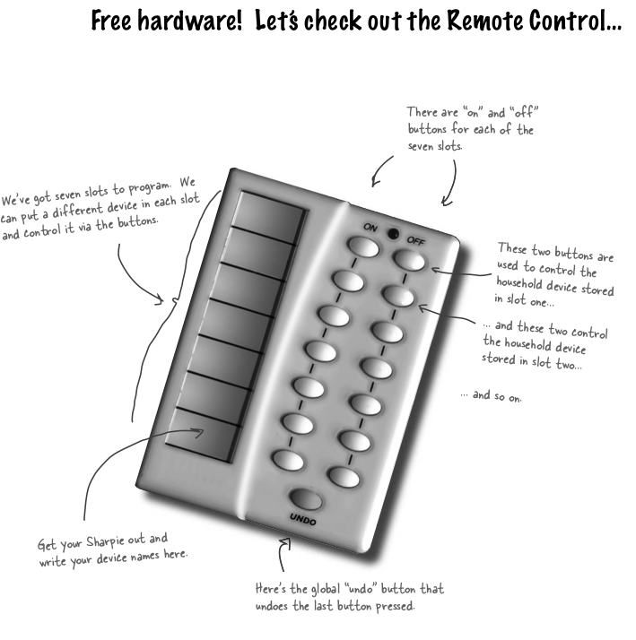
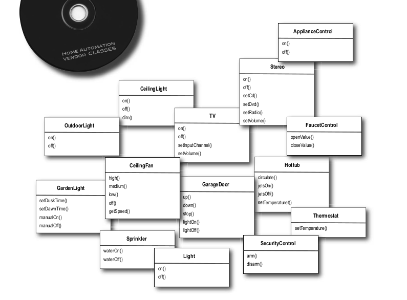
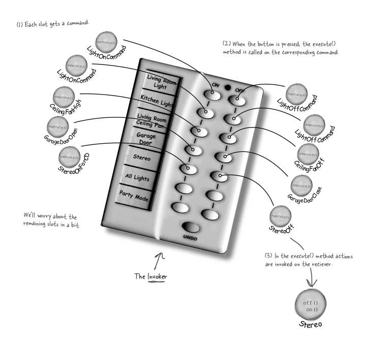
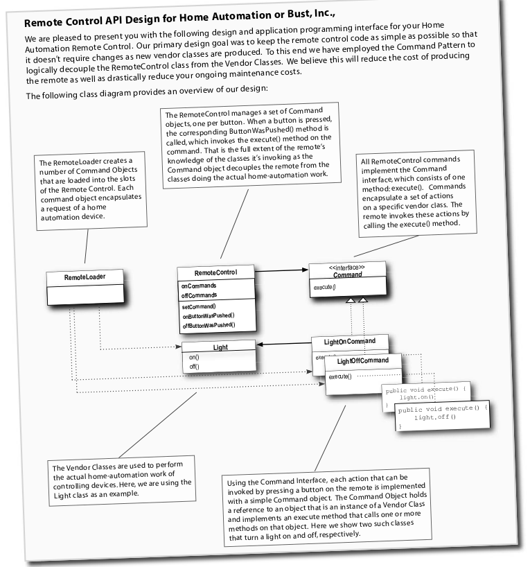
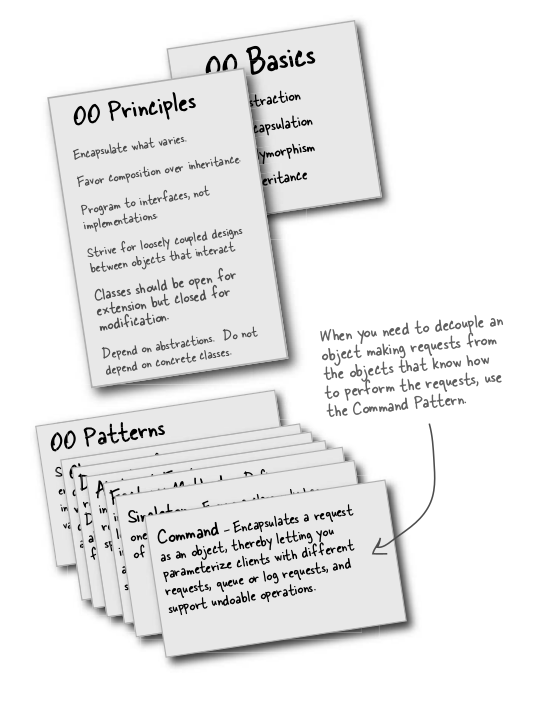

#Command Pattern

You are asked to implement a home automation API for a remote which has 7 slots and each slot has 'on' and 'off' button for each appliance, and we have 
a undo button also in the remote, which undos the last command.

You can see we have following remote

And we have following implementation by vendors

We have a fan which can be made high and low, we have garage door and we have different appliances on which different operations can be performed.

We will you command pattern which make command remote loosely coupled and thus make changes very easy 

#####Definition
The Command Pattern encapsulates a request as an object, thereby letting you parameterize other objects
with different requests, queue or log requests, and support undoable operations.

After command pattern and how things fall in place

API docs

Summary

