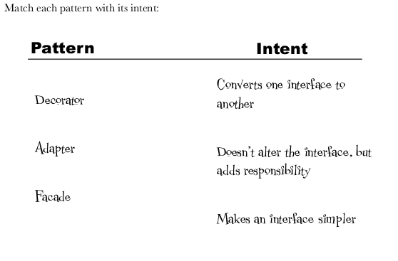
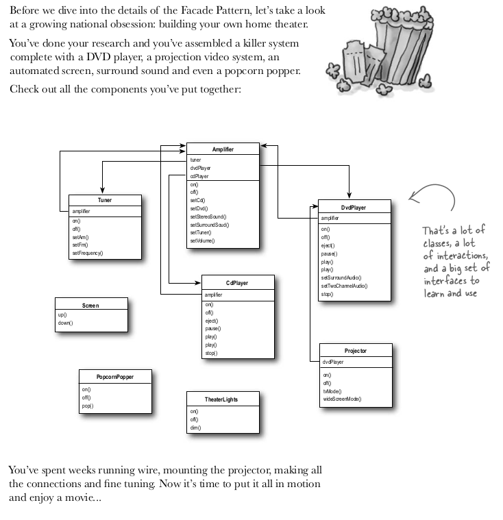
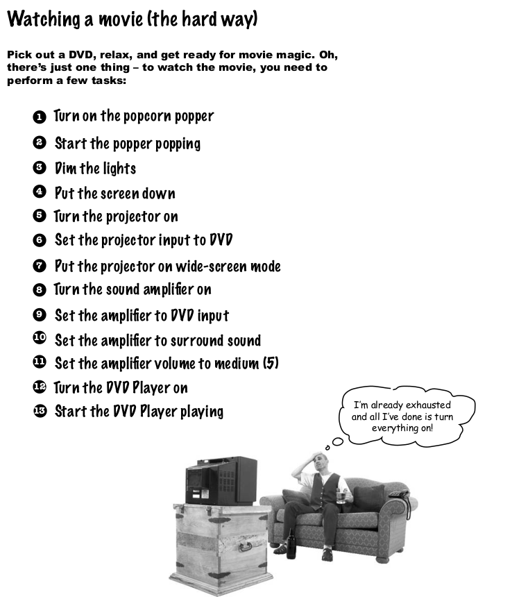
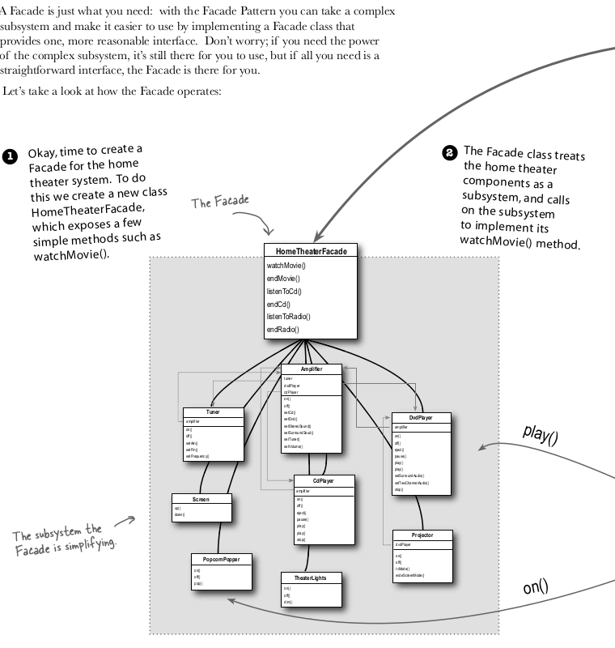
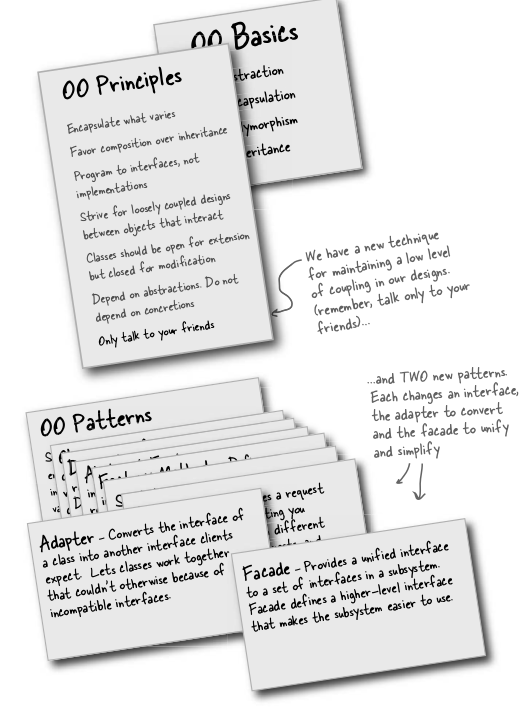

# Adapter and Facade Pattern

The Adapter Pattern converts the interface of a class into another interface the clients expect. Adapter lets
classes work together that couldn’t otherwise because of incompatible interfaces.

Answer is 
- Decorator is for adding responsibilities
- adapter is for converting one interface to another
- facade is for making interface simpler

U can see the simple implementation of adapter in chapter7's adapter package

Facade is simple, very intiutive.

The Facade Pattern provides a unifi ed interface to a set of interfaces in a subsytem. Facade defi nes a higher-
level interface that makes the subsystem easier to use.

#### Problem : Making a home theater

Lets see how facade solve this, and code can be found in facade package

Summary

