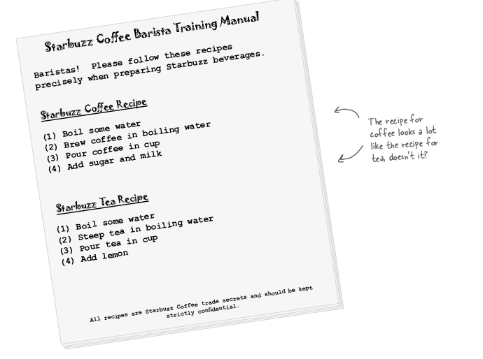
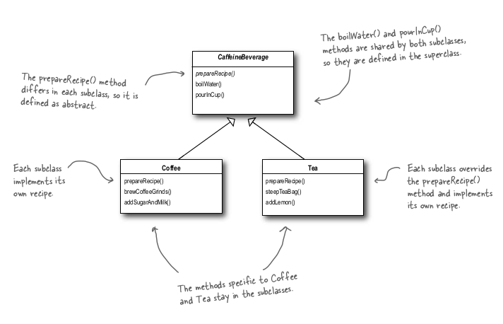
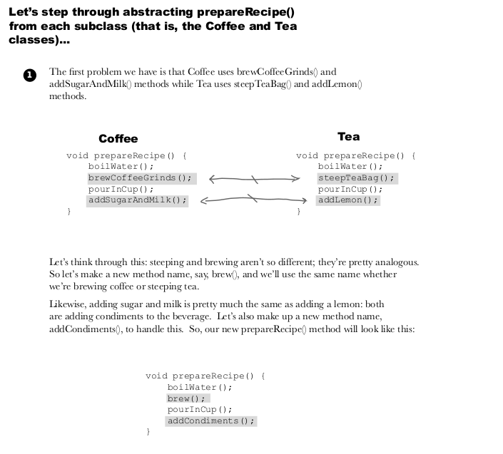
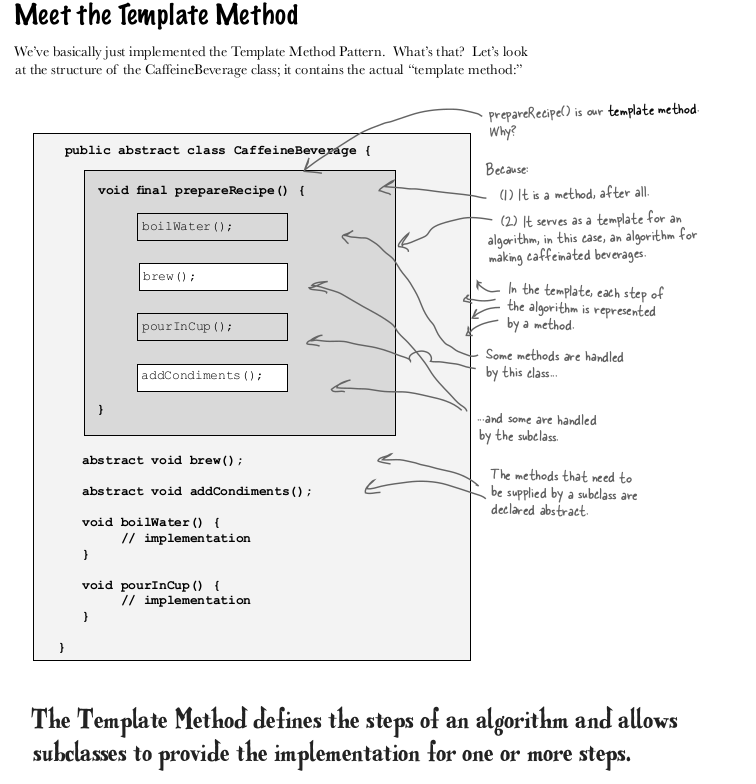
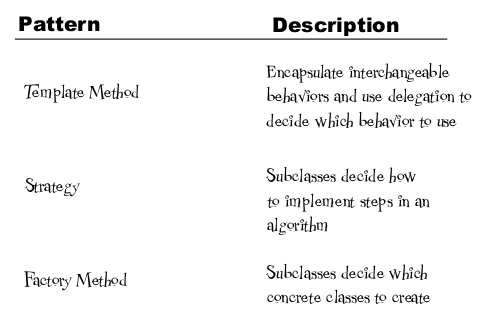
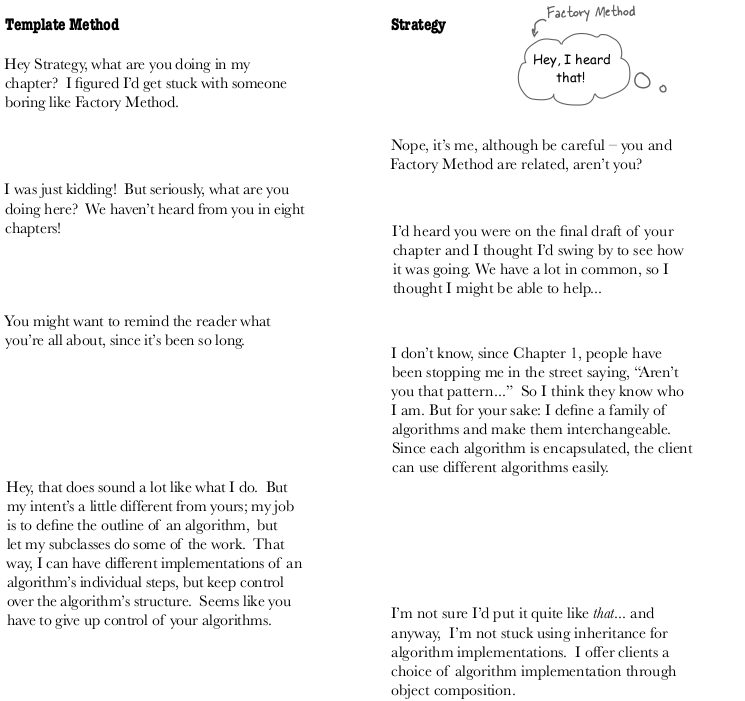
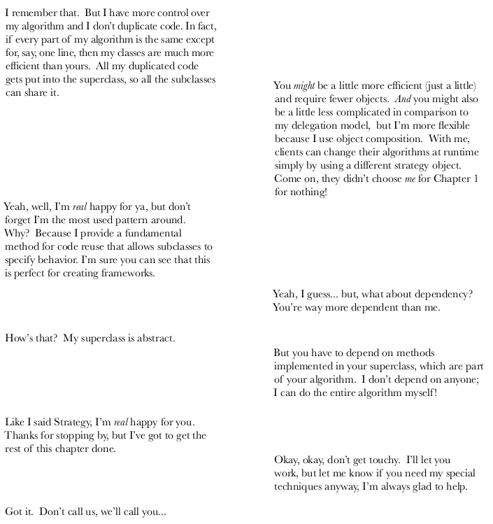
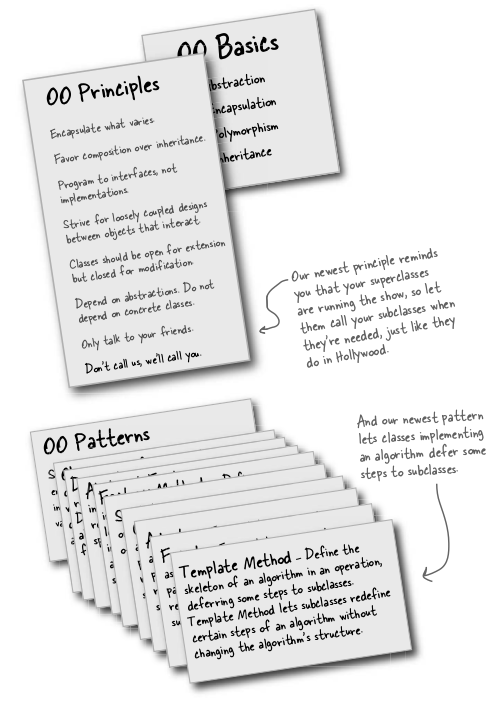

# Problem
Lets make some beverages to drink, tea and coffee.
Here are steps for making them



We can see there are some steps common and we can encapsute these common in base class let other subclass changes the changing algo.



But we can also further abstract the methods. Like see below




# Template Pattern



The Template Method Pattern defines the skeleton of an algorithm in a method, deferring some steps to
subclasses. Template Method lets subclasses redefine certain steps of an algorithm without changing the algorithm’s structure.

This pattern is all about creating a template for an algorithm. What’s a template?
As you’ve seen it’s just a method; more specifically, it’s a method that defines an
algorithm as a set of steps. One or more of these steps is defined to be abstract and
implemented by a subclass. This ensures the algorithm’s structure stays unchanged,
while subclasses provide some part of the implementation.

### Hooks
Hooks are method which in super class and sub-class have choice to implement them or not.

# Hollywood Principle
Don’t call us, we’ll call you

This principle avoid cyclic dependency between high-level component and low level components.

How does the Hollywood Principle relate to the Dependency Inversion Principle that we learned a few chapters back?
````
    The Dependency Inversion
    Principle teaches us to avoid the use of
    concrete classes and instead work as
    much as possible with abstractions. The
    Hollywood Principle is a technique for
    building frameworks or components so that
    lower-level components can be hooked
    into the computation, but without creating
    dependencies between the lower-level
    components and the higher-level layers. So,
    they both have the goal of decoupling, but
    the Dependency Inversion Principle makes a
    much stronger and general statement about
    how to avoid dependencies in design.
    The Hollywood Principle gives us a
    technique for creating designs that allow
    low-level structures to interoperate while
    preventing other classes from becoming too
    dependent on them.
````
Is a low-level component disallowed from calling a method in a higher-level component?
```
    Not really. In fact, a low level
    component will often end up calling a method
    defined above it in the inheritance hierarchy
    purely through inheritance. But we want to
    avoid creating explicit circular dependencies
    between the low-level component and the
    high-level ones.
```
# Match these

Template - subclass decides how to implement steps in algo
Strategy - Encapsulate full interchangable algo / behaviour and use delegation to decide which behaviour to use   
Factory - let subclass decide how to create concrete class.


### Template and Strategy




#### Note
Overriding toComp() in custom object when sorting that type of array using Java Array.Sort() , is an example of Template pattern, providing toCompare() is called an example.

In strategy pattern we have sub-class implementing full algo, but in template pattern we let subclass implement a sub-part to algo.


Summary




