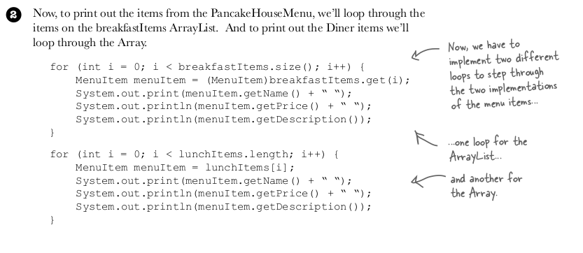
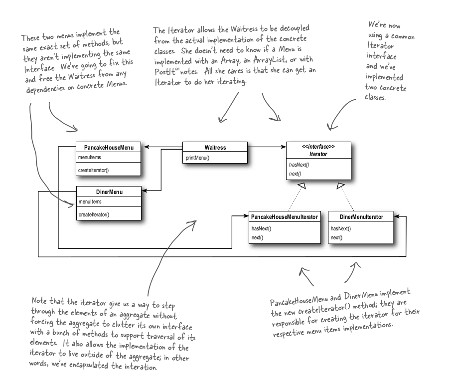
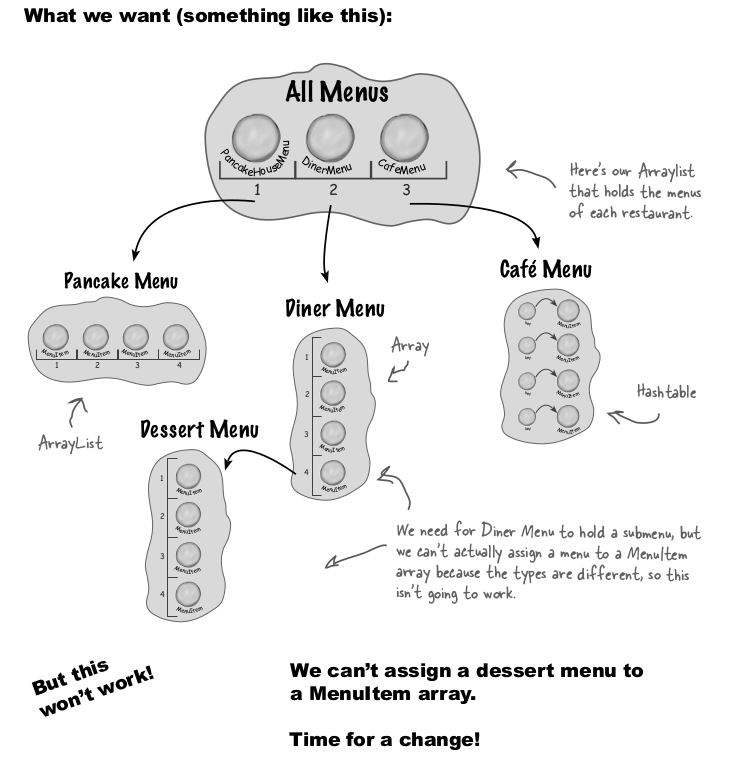
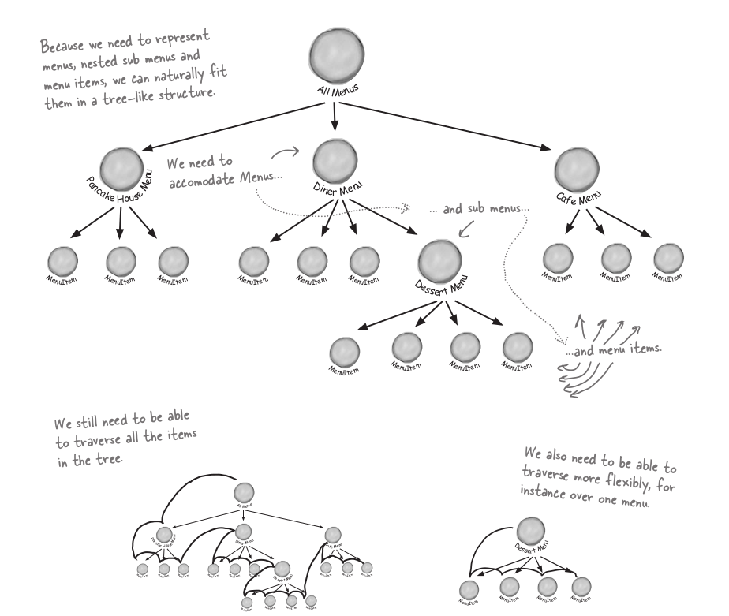
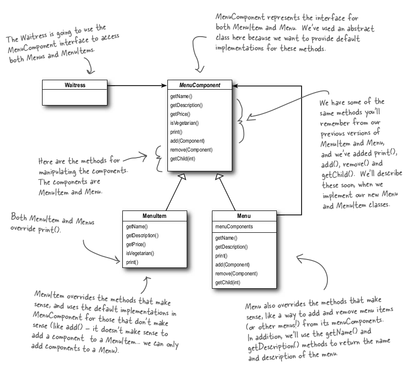
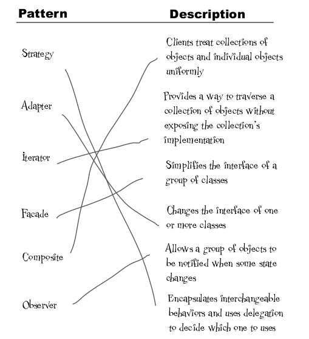
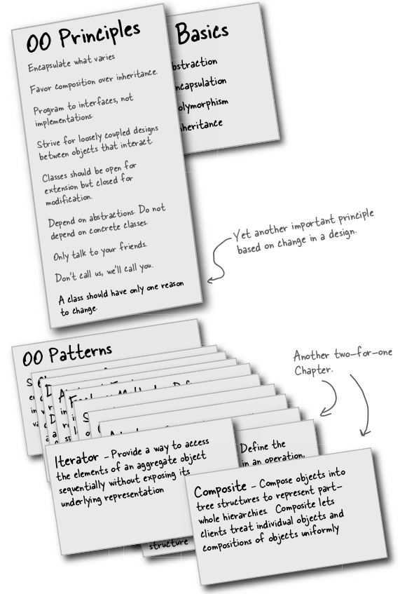

# Iterator and Composite Pattern

## Iterator pattern
The Iterator Pattern provides a way to access the elements of an aggregate object sequentially without exposing its underlying representation.

### Problem
We have two list dinner-list and lunch-list provider class, but the problem is that both use different approach, one use arraylist and one use array, and they
both have bunch of arrayList and array's functionality which work on arraylist and array. Now we want a central class which would query lunch and dinner list and show it.
One way to achieve this is as follows

We are using two loops. 

If there are 3 list, then 3 loops?

Is there a better way?

A better way is to let both of them implement iterator interface and it would make it much easier

Refer Code for More concrete code example.

## Composite Pattern
The Composite Pattern allows you to compose objects into tree structures to
represent part-whole hierarchies. Composite lets clients treat individual objects and
compositions of objects uniformly.

## Problem

Sub menu within menu, how do we achieve this is where composite pattern come to rescue.

## Match the Column

## Summary

## Note
If we’ve learned one thing in this book, it’s encapsulate what varies.

